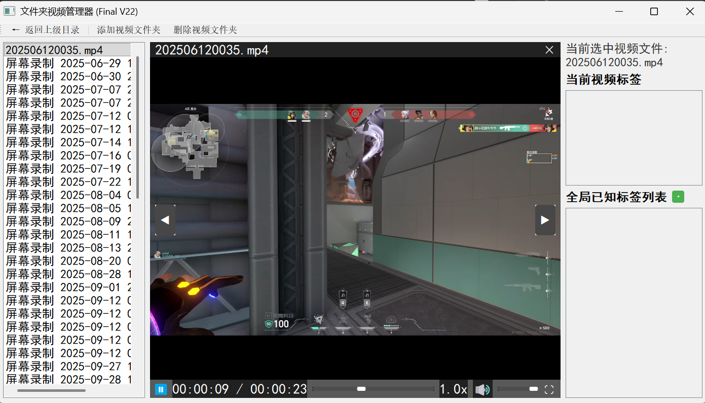

# 文件夹视频管理器 (Folder Video Manager)

<div align="center">
  <h3>一个基于 PyQt5 的本地视频文件夹管理与播放工具</h3>
  
  

  <strong>作者: AkiyamaFansora</strong><br>
  <em>个人学生项目</em>
</div>

---

## 📝 项目简介

这是我个人在寒假期间开发的 Python 应用程序。它使用 PyQt5 构建图形界面，并利用 VLC 播放器核心来管理和播放本地视频文件。该项目旨在实践 GUI 编程和媒体处理技术。

## ✨ 功能特性

*   **多文件夹管理**: 用户可以添加本地文件夹，程序会扫描其中的 `.mp4`, `.mkv`, `.avi` 等常见视频文件。
*   **视频标签系统**: 为视频文件添加自定义标签，方便分类和筛选。
*   **播放状态记忆**: 程序会自动记录每个视频的播放进度、音量、播放速率等信息，下次打开时自动恢复。
*   **基础播放控制**: 包含播放/暂停、快进/快退、音量调节、倍速播放等功能。
*   **数据持久化**: 所有配置、标签、播放状态等信息都会保存在本地 JSON 文件中。

## 🛠️ 技术栈

*   **语言**: Python 3.x
*   **GUI框架**: PyQt5
*   **媒体播放器**: python-vlc (VLC 绑定)
*   **数据存储**: JSON

## 🚀 如何运行

### 环境要求

*   Python 3.6 或更高版本
*   已安装 [VLC Media Player](https://www.videolan.org/vlc/) (桌面版)

### 安装与启动

1.  **克隆此仓库**:
    ```bash
    git clone https://github.com/AkiyamaFansora/Video-Tag-Manager.git
    cd Video-Tag-Manager
    ```
    <!-- 或者，如果您不熟悉 Git，可以直接下载 ZIP 文件并解压 -->

2.  **安装 Python 依赖**:
    ```bash
    pip install -r requirements.txt
    ```
    <!-- 如果没有找到 requirements.txt，请看下一步手动安装 -->

3.  **手动安装依赖 (如果上述命令失败)**:
    ```bash
    pip install PyQt5 python-vlc
    ```

4.  **运行主程序**:
    ```bash
    python main.py
    ```

## 📁 项目结构
.
├── main.py # 程序入口

├── folder_video_manager.py # 主窗口和核心逻辑

├── video_player.py # 视频播放器组件

├── data_manager.py # 数据读写管理 (JSON)

├── ui_components.py # 自定义 UI 控件

├── requirements.txt # Python 依赖列表

├── README.md # 本说明文件

├── Image/ # 本说明文件附带图片 (如果有的话)

├── LICENSE # 开源许可证

└── Save/ # 数据存储目录 (运行后自动生成)

├── FolderPath.json

├── AllMoviesLabel.json

├── AllKnownTags.json

└── video_playback_state.json

text

编辑


## ⚠️ 版权声明 & 使用许可

本项目遵循 [GNU General Public License v3.0 (GPL-3.0)](./LICENSE) 开源协议。

**重要提示**:
*   本项目由学生 **AkiyamaFansora** 独立开发。
*   仅可用于 **个人学习、研究和非商业用途**。
*   **严禁**在未经本人明确授权的情况下，将本项目或其核心代码用于任何**商业目的** (例如，嵌入商业软件、销售、盈利性服务等)。
*   如需将本项目用于商业环境，请联系作者 (联系方式见下方) 获取书面许可。

## 🤝 贡献

由于这是一个已完成的学生课程项目，目前暂不接受外部功能贡献。但非常欢迎您提出 Issue 来报告 Bug 或提供建议！

## 📬 联系方式

*   GitHub: [https://github.com/AkiyamaFansora](https://github.com/AkiyamaFansora)
*   Email: [674251583@qq.com](mailto:674251583@qq.com) / [AkiyamaFansora@gmail.com](mailto:AkiyamaFansora@gmail.com)

---

*感谢您对这个小项目的关注！*